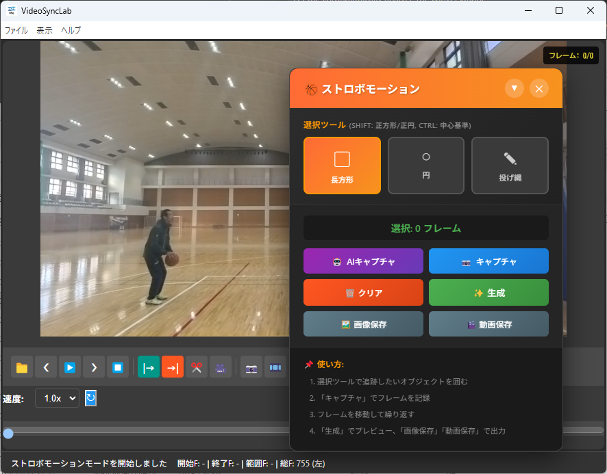
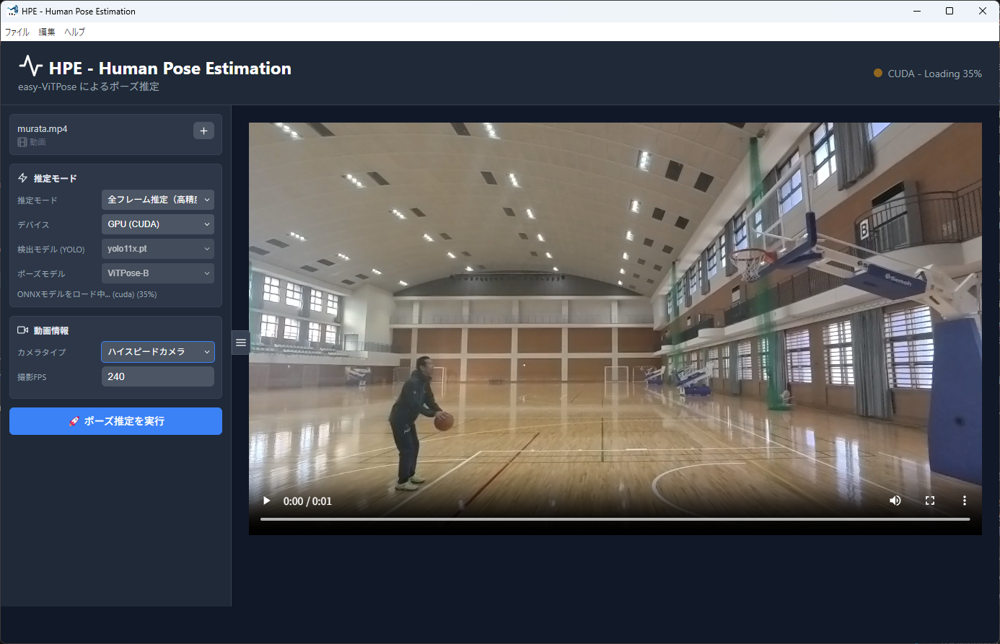
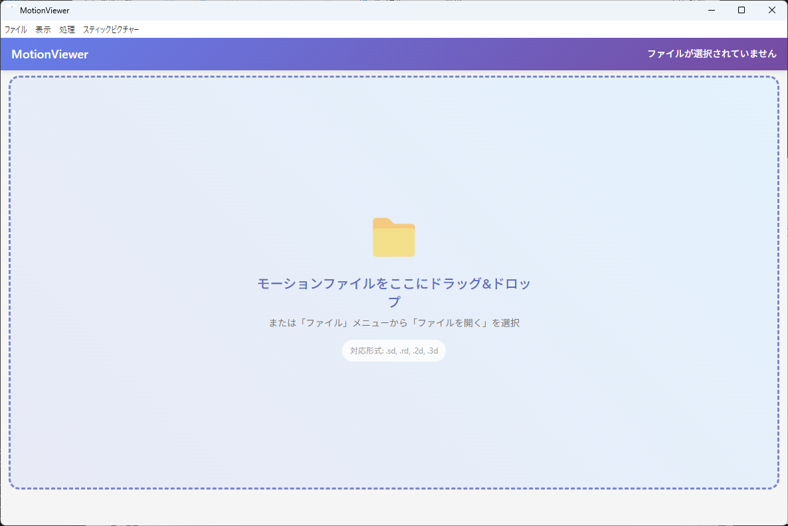

  SBM Integration Map | データフローガイド    /\* Integration Map specific styles \*/ .flow-main { display: flex; flex-direction: column; gap: 0; margin: 2rem 0; } .flow-node { background: rgba(255, 255, 255, 0.04); border: 1px solid rgba(255, 255, 255, 0.1); border-radius: 12px; padding: 1.5rem; position: relative; } .flow-node .node-header { display: flex; align-items: center; gap: 1rem; margin-bottom: 0.8rem; } .flow-node .node-icon { width: 48px; height: 48px; border-radius: 12px; display: flex; align-items: center; justify-content: center; font-size: 1.4rem; flex-shrink: 0; } .flow-node .node-title { font-size: 1.1rem; font-weight: 700; color: var(--text-primary); } .flow-node .node-subtitle { font-size: 0.82rem; color: var(--text-secondary); } .flow-connector { display: flex; align-items: center; justify-content: center; padding: 0.4rem 0; position: relative; } .flow-connector .connector-line { width: 2px; height: 30px; background: linear-gradient(to bottom, rgba(59, 130, 246, 0.6), rgba(6, 182, 212, 0.6)); } .flow-connector .connector-file { position: absolute; left: 55%; background: rgba(16, 185, 129, 0.15); border: 1px solid rgba(16, 185, 129, 0.4); border-radius: 20px; padding: 3px 14px; font-size: 0.78rem; font-weight: 600; color: #34d399; white-space: nowrap; } .data-sample { background: rgba(0, 0, 0, 0.4); border: 1px solid rgba(255, 255, 255, 0.08); border-radius: 8px; padding: 1rem 1.2rem; font-family: 'Fira Code', 'Consolas', monospace; font-size: 0.78rem; line-height: 1.7; color: #e2e8f0; overflow-x: auto; margin: 1rem 0; position: relative; } .data-sample .label { position: absolute; top: 0; right: 0; background: rgba(139, 92, 246, 0.2); color: #a78bfa; font-size: 0.7rem; font-weight: 600; padding: 3px 10px; border-radius: 0 8px 0 8px; } .data-sample .comment { color: #6b7280; } .data-sample .highlight { color: #fbbf24; } .data-sample .string { color: #34d399; } .data-sample .key { color: #93c5fd; } .format-table { width: 100%; border-collapse: collapse; margin: 1rem 0; font-size: 0.88rem; } .format-table th { background: rgba(139, 92, 246, 0.12); color: var(--accent-purple); padding: 0.6rem 0.8rem; text-align: left; border-bottom: 2px solid rgba(139, 92, 246, 0.3); font-weight: 600; } .format-table td { padding: 0.5rem 0.8rem; border-bottom: 1px solid rgba(255, 255, 255, 0.06); vertical-align: top; } .format-table tr:hover td { background: rgba(255, 255, 255, 0.02); } .format-table code { background: rgba(0, 0, 0, 0.3); padding: 1px 5px; border-radius: 3px; font-size: 0.85em; color: #93c5fd; } .ext-badge { display: inline-block; padding: 2px 10px; border-radius: 20px; font-size: 0.8rem; font-weight: 700; font-family: 'Fira Code', 'Consolas', monospace; } .ext-mp4 { background: rgba(239, 68, 68, 0.15); color: #f87171; border: 1px solid rgba(239, 68, 68, 0.3); } .ext-hpe { background: rgba(59, 130, 246, 0.15); color: #60a5fa; border: 1px solid rgba(59, 130, 246, 0.3); } .ext-csv { background: rgba(16, 185, 129, 0.15); color: #34d399; border: 1px solid rgba(16, 185, 129, 0.3); } .ext-rd { background: rgba(251, 191, 36, 0.15); color: #fbbf24; border: 1px solid rgba(251, 191, 36, 0.3); } .ext-3d { background: rgba(139, 92, 246, 0.15); color: #a78bfa; border: 1px solid rgba(139, 92, 246, 0.3); } .ext-c3d { background: rgba(236, 72, 153, 0.15); color: #f472b6; border: 1px solid rgba(236, 72, 153, 0.3); } .kp-grid { display: grid; grid-template-columns: repeat(auto-fill, minmax(180px, 1fr)); gap: 0.3rem; margin: 1rem 0; font-size: 0.82rem; } .kp-item { display: flex; align-items: center; gap: 0.5rem; padding: 0.3rem 0.6rem; background: rgba(255, 255, 255, 0.03); border-radius: 6px; } .kp-item .kp-id { color: var(--accent-cyan); font-weight: 700; font-family: 'Fira Code', 'Consolas', monospace; min-width: 1.5rem; text-align: right; } .kp-item .kp-name { color: var(--text-secondary); } .tip-box { background: rgba(16, 185, 129, 0.08); border-left: 3px solid #10b981; padding: 1rem 1.2rem; border-radius: 0 8px 8px 0; margin: 1rem 0; font-size: 0.92rem; } .tip-box strong { color: #34d399; } .warn-box { background: rgba(251, 191, 36, 0.08); border-left: 3px solid #fbbf24; padding: 1rem 1.2rem; border-radius: 0 8px 8px 0; margin: 1rem 0; font-size: 0.92rem; } .warn-box strong { color: #fbbf24; } .check-item { display: flex; align-items: flex-start; gap: 0.5rem; margin: 0.5rem 0; color: var(--text-secondary); font-size: 0.9rem; } .check-item::before { content: "✓"; color: #10b981; font-weight: 700; flex-shrink: 0; } .two-col { display: grid; grid-template-columns: 1fr 1fr; gap: 1rem; margin: 1rem 0; } @media (max-width: 768px) { .two-col { grid-template-columns: 1fr; } } .sub-section { margin-top: 2.5rem; } .sub-section:first-of-type { margin-top: 1.5rem; } .decision-box { background: rgba(59, 130, 246, 0.06); border: 1px solid rgba(59, 130, 246, 0.2); border-radius: 10px; padding: 1.2rem; margin: 1rem 0; } .decision-box h4 { margin-top: 0; color: var(--accent-blue); }

SBM System Analytics Suite

[User Manual](SBM_User_Manual.html) [Integration Map](SBM_Integration_Map.html) [Technical Bible](SBM_Technical_Bible.html)

Data Flow Guide File Format Reference Step-by-Step Pipeline

# Data Journey  
Integration Map

動画ファイルが23点の身体座標に変換され、実長換算を経て運動学データになるまで。  
各ステップで「何が入力され、何が出力されるか」を具体的に示す。

## Pipeline Overview

SBM Systemの全データフローを一覧で示す。各アプリは独立しており、ファイルを介してデータを受け渡す。

Phase 1: VideoSyncLab

動画の同期・トリミング・分析区間の切り出し

.mp4 入力

撮影した動画ファイルを読み込み、分析に必要な区間だけを切り出す。マルチカメラの場合は同期ポイントを設定して時間軸を一致させる。

\*\_cut.mp4

Phase 2: HPE (AI骨格推定)

YOLO + ViTPose による23点の身体座標値推定

.mp4 入力

AI が全フレームの人物を検出し、23箇所のキーポイントをピクセル座標で出力する。フィルタリングとノイズ除去もここで行う。

.hpe / .csv

Phase 3: MotionDigitizer (実長換算)

ピクセル座標 → 実世界座標（メートル）への変換

.hpe 入力

キャリブレーション（DLT/CC法）で座標変換パラメータを算出し、ピクセル座標を実長（メートル）に変換する。

.rd / .3d / .c3d

Phase 4: MotionViewer (データ確認・分析)

3D可視化・速度・角度・重心の算出

.rd / .3d 入力

スティックピクチャーの3D表示、時系列グラフ、関節角度、身体重心（COM）など運動学パラメータを算出・可視化する。

##  Phase 1: 動画ファイルの準備

分析の品質は入力動画の品質で決まる。 VideoSyncLabで分析区間を正確に切り出し、HPEに渡すための最適な .mp4 を生成する。

### 入力: 撮影動画

項目

推奨

備考

形式

`.mp4` (H.264)

ほぼ全てのカメラで標準

解像度

1080p 以上

高いほどキーポイント精度向上

フレームレート

30fps〜240fps

高速動作の場合はハイスピード推奨

カメラ台数

2D分析: 1台 / 3D分析: 2台以上

角度差は60°〜120°が理想

### 出力: トリミング済み動画

Smart Cut または再エンコードで分析区間のみを切り出す。出力ファイル名は元のファイル名に `_cut` が付加される。

出力ファイル例 \# 例: pitch\_cam1.mp4 をフレーム 120〜350 でトリム pitch\_cam1\_cut.mp4 ← HPE に渡すファイル pitch\_cam2\_cut.mp4 ← 2台目（3D分析の場合）

**Tip:** マルチカメラの場合、VideoSyncLab で同期ポイントを設定してからトリミングすると、 両カメラの切り出し開始フレームが自動的に一致する。 これにより Phase 3 のMotionDigitizerでのフレーム対応づけが正確になる。

### 2D分析 vs 3D分析の選択

#### 2D分析（カメラ1台）

動作が概ねカメラに平行な平面内で行われる

例: サジタル面での歩行、走行、跳躍

必要なカメラ: 1台

出力: .rd（2D実長座標）

#### 3D分析（カメラ2台以上）

動作に奥行き方向の成分がある

例: 投球、旋回動作、ダンス

必要なカメラ: 2台以上

出力: .3d（3D実長座標）

##  Phase 2: AI骨格推定（HPE）

トリミング済みの .mp4 をHPEに渡し、 全フレームの身体23点のピクセル座標を自動推定する。

### 23キーポイントの定義

ViTPoseの133点出力から、バイオメカニクス分析に必要な23点を選択・マッピングしている。

1右手指先

2右手首

3右肘

4右肩

5左手指先

6左手首

7左肘

8左肩

9右つま先

10右小指側

11右かかと

12右足首

13右膝

14右股関節

15左つま先

16左小指側

17左かかと

18左足首

19左膝

20左股関節

21頭頂

22耳珠点

23胸骨上縁

### 出力形式 1: .hpe プロジェクトファイル

HPEのプロジェクト全体を保存するJSON形式。フィルタリング設定や編集履歴を含む。**MotionDigitizerへの引き渡しにはこの形式が推奨。**

.hpe ファイル構造 { "version": "1.2", "fileType": "video", "fileName": "pitch\_cam1\_cut.mp4", "originalData": { "fps": 30, "width": 1920, "height": 1080, "total\_frames": 300, "keypoint\_names": \["right\_hand\_tip", "right\_wrist", ...\], "frames": \[ { "frame": 1, "keypoints": { "0": \[ ← 人物ID "0" の23点 \[320.45, 180.23, 0.95\], ← \[x(px), y(px), 信頼度\] \[310.12, 200.45, 0.87\], ... ← 23点分 \] } }, ... \] }, "filteredData": { ... }, ← フィルタ適用後のデータ（優先使用） "filterSettings": { "enableButterworth": true, "butterworthCutoff": 6.0, ... } }

**重要:** `filteredData` が存在する場合、MotionDigitizerは `originalData` ではなく `filteredData` を優先的に読み込む。 HPEでフィルタリングを完了してから保存すること。

### 出力形式 2: .csv テキストデータ

人物ごとに個別出力されるカンマ区切りテキスト。Excel等で直接開ける。

.csv ヘッダーと先頭行 frame,right\_hand\_tip\_x,right\_hand\_tip\_y,right\_wrist\_x,right\_wrist\_y,...,right\_hand\_tip\_conf,right\_wrist\_conf,... 1,320.45,180.23,310.12,200.45,...,0.95,0.87,... 2,321.02,179.98,310.87,201.12,...,0.94,0.88,...

列

内容

単位

`frame`

フレーム番号（1始まり）

—

`{name}_x`

キーポイントのX座標

ピクセル

`{name}_y`

キーポイントのY座標

ピクセル

`{name}_conf`

信頼度スコア (0.0〜1.0)

—

**Tip:** CSVの座標値はピクセル単位。この段階ではまだ実世界の長さ（メートル）には変換されていない。 実長への変換は次のPhase 3で行う。

### データ品質チェックポイント

HPE → MotionDigitizer に渡す前に確認すべき事項:

全フレームでターゲット人物が検出されているか（欠損フレームがないか）

オクルージョン（隠れ）区間でキーポイントが大きく飛んでいないか

左右の入替が発生していないか（グラフで急激な交差がないか）

フィルタリング（外れ値除去 → 補間 → Butterworth）を適用済みか

複数人物がいる場合、正しい人物IDを選択しているか

##  Phase 3: 実長換算（MotionDigitizer）

HPEの出力 .hpe を読み込み、 キャリブレーションで座標変換パラメータを算出した後、全フレームのピクセル座標を実長（メートル）に一括変換する。

### HPEデータの取り込み

MotionDigitizerは `.hpe` ファイルを読み込み、23キーポイントを内部のポイントID（1〜23）にマッピングする。

HPEキーポイント名

→

MotionDigitizer ポイントID

`right_hand_tip`

→

Point 1

`right_wrist`

→

Point 2

`right_elbow`

→

Point 3

`right_shoulder`

→

Point 4

... （同様に23点がマッピングされる）

`head_top`

→

Point 21

`tragus_point`

→

Point 22

`suprasternal_notch`

→

Point 23

**注意:** 信頼度が 0.1 未満のキーポイントは自動的に欠損値として扱われる。 HPEの段階で十分なフィルタリングを行っておくことが重要。

### キャリブレーション方法の選択

#### 実長換算（4点法）

映像内の既知距離（身長、マーカー間距離など）を基準にスケールを設定。

2D分析のみ

制御点の設置が不要

手軽だが精度は限定的

#### DLT法

既知の3D座標を持つ制御点（6点以上）を使って座標変換定数を算出。

2D (8定数) / 3D (11定数) 対応

制御点が多いほど精度向上

標準的な手法

#### CC法

非線形カメラモデル（レンズ歪み補正含む）のパラメータを最適化で推定。

最高精度

レンズ歪みを自動補正

計算に時間がかかる

#### ChArUcoキャリブレーション

ChArUcoボードの画像からカメラ内部パラメータを自動取得。CC法と組み合わせて使用。

焦点距離・歪み係数を自動算出

CC法の初期値として有効

OpenCV nativeモジュール使用

### 出力形式: .rd / .3d

座標変換後のデータは、MotionViewerが読み込めるテキスト形式で出力される。

#### ファイル構造（共通）

.rd / .3d 共通フォーマット ヘッダー行（1行目）: 300,23,0.004000 ← フレーム数, ポイント数, 1フレーム時間(秒) データ行（2行目以降）: 各フレームの全ポイント座標をカンマ区切り

#### 2Dファイル: .rd

.rd データ例（2D: 1フレーム = 23点 × 2座標 = 46値） 300,23,0.004000 0.123456,1.234567,0.234567,1.345678,... ← pt1\_x, pt1\_y, pt2\_x, pt2\_y, ... 0.124567,1.235678,0.235678,1.346789,... ← フレーム2 ... ← フレーム300まで

#### 3Dファイル: .3d

.3d データ例（3D: 1フレーム = 23点 × 3座標 = 69値） 300,23,0.004000 0.123,1.234,0.567,0.234,1.345,0.678,... ← pt1\_x, pt1\_y, pt1\_z, pt2\_x, pt2\_y, pt2\_z, ... 0.124,1.235,0.568,0.235,1.346,0.679,... ← フレーム2 ...

項目

詳細

ヘッダー列1

フレーム数（例: 300）

ヘッダー列2

ポイント数（例: 23）

ヘッダー列3

フレーム間隔（秒） = `1 / fps`（例: 0.004000 = 250fps）

座標単位

**メートル**（キャリブレーション後の実長座標）

精度

小数点以下6桁（`toFixed(6)`）

欠損値

`0.000000,0.000000`（2D）または `0.000000,0.000000,0.000000`（3D）

### 出力形式（補助）: .c3d

バイオメカニクスの国際標準バイナリ交換フォーマット。Visual3D、MATLAB、Cortex等の外部ソフトウェアとデータを共有する際に使用。 3Dデータのエクスポートに対応。

### Phase 3 → Phase 4 への引き渡しチェック

キャリブレーションの再投影誤差が十分小さいか（DLT: 1px以下 / CC: 0.5px以下が目安）

出力ファイルのフレーム数が入力動画のフレーム数と一致しているか

欠損フレーム（0,0,0）が許容範囲内か

座標値のオーダーが妥当か（人体サイズ: 通常 0〜2m 程度）

##  Phase 4: データ確認・分析（MotionViewer）

実長換算済みの .rd / .3d を読み込み、スティックピクチャーの可視化と運動学パラメータの算出を行う。

### 入力と次元自動判定

MotionViewerはヘッダーの情報とデータ列数から、自動的に2D/3Dを判定する。

判定ロジック

条件

結果

列数 / ポイント数

\= 2

2Dデータとして処理

列数 / ポイント数

\= 3

3Dデータとして処理（3Dビュー有効化）

対応拡張子

用途

`.rd`

実長換算済み2D座標（MotionDigitizer出力）

`.3d`

3D復元座標（MotionDigitizer出力）

`.sd`

2Dデータ（旧形式互換）

`.2d`

2Dデータ（別名）

### Butterworthフィルタ（再フィルタリング）

実長換算後のデータに対して、改めてButterworthローパスフィルタを適用できる。 HPEの段階でフィルタ済みでも、座標変換後にノイズが増幅されている場合に有効。

設定

説明

カットオフ周波数

手動設定（Hz）または Wells & Winter 法で自動決定

フィルタ次数

4次（ゼロ位相filtfiltで実効8次相当）

### 分析機能の出力

MotionViewerで算出・可視化できる運動学パラメータ:

パラメータ

内容

出力

**Stick Picture**

各フレームの骨格をスティック図で描画。3Dの場合はOrbitControlsで自由回転可能。

画面表示 / MP4動画エクスポート

**速度・加速度**

各キーポイントの合成速度。中央差分法で算出。

時系列グラフ / CSVエクスポート

**関節角度**

14箇所の関節角度（肘、肩、股関節、膝、足首、手首、体幹、骨盤）。

時系列グラフ / CSVエクスポート

**セグメント角度**

各セグメントの座標軸に対する絶対角度（atan2投影）。

時系列グラフ / CSVエクスポート

**身体重心 (COM)**

BSPモデル（Abe成人 / Yokoi小児 / Okada高齢者）に基づく全身重心の軌跡。

3D軌跡 / 時系列グラフ

## 実践例: 投球動作の2D分析

野球の投球動作を1台のカメラで撮影し、2D分析する場合の具体的なデータフロー。

### Step 1: 撮影 & VideoSyncLab

\# 撮影 カメラ: iPhone 15 Pro / 240fps / 1080p 位置: 三塁側ベンチ（投球方向に対して直角） ファイル: pitch\_240fps.mp4 (8秒 = 1920フレーム) \# VideoSyncLab でトリミング IN点: フレーム 480 (ワインドアップ開始) OUT点: フレーム 720 (フォロースルー完了) 出力: pitch\_240fps\_cut.mp4 (240フレーム = 1秒間)

### Step 2: HPE でAI骨格推定

\# HPE 設定 検出モデル: YOLO11x 推定モデル: ViTPose-H (WholeBody) カメラ種別: ハイスピード (240fps) \# フィルタリング 外れ値除去: ON (速度ベース) 補間: PCHIP Butterworth: ON (カットオフ 10Hz) \# 出力 pitch\_240fps\_cut.hpe ← MotionDigitizerに渡す pitch\_240fps\_cut\_person0.csv ← 参考用

### Step 3: MotionDigitizer で実長換算

\# HPEインポート 読み込み: pitch\_240fps\_cut.hpe 人物選択: Person 0 (投手) カメラ: cam1 \# キャリブレーション（2D-DLT法） 制御点: 6点（マウンドプレート四隅 + ホームベース2点） 再投影誤差: 0.8 px → OK \# 出力 pitch\_240fps\_cut.rd ← MotionViewerに渡す \# .rd の中身（ヘッダー） 240,23,0.004167 ← 240フレーム, 23点, 1/240秒 0.123456,1.789012,0.234567,1.678901,... ← 単位はメートル

### Step 4: MotionViewer で分析

\# 読み込み pitch\_240fps\_cut.rd → 自動判定: 2Dデータ (46列 / 23点 = 2) \# Butterworthフィルタ カットオフ: 自動 (Wells & Winter) → 12.5 Hz \# 分析結果 右手指先(Point 1) 最大速度: 32.4 m/s (フレーム 185) 右肘(Point 3) 最大角速度: 2,450 °/s (フレーム 178) 体幹前傾 最大角度: 42.3° (フレーム 190)

## ファイル形式クイックリファレンス

拡張子

アプリ

形式

座標単位

用途

.mp4

VideoSyncLab

動画

—

分析対象の動画ファイル

.hpe

HPE → MD

JSON

ピクセル

AI推定座標 + メタデータ（推奨引き渡し形式）

.csv

HPE

CSV

ピクセル

人物ごとの座標データ（Excel等で閲覧可）

.rd

MD → MV

CSV

**メートル**

実長換算済み2D座標

.3d

MD → MV

CSV

**メートル**

3D復元座標

.c3d

MD → 外部

Binary

**メートル**

国際標準交換フォーマット（Visual3D等）

**座標単位の変化に注目:**  
HPEの出力は**ピクセル座標**（画像上の位置）。 MotionDigitizerのキャリブレーションを経て初めて**メートル座標**（実世界の位置）に変換される。 MotionViewerが扱うのは常にメートル座標。

© 2026 Electoron Biomechanics Suite | Data Flow & Integration Documentation