  SBM User Manual | 操作ガイド    /\* Manual-specific styles \*/ .kbd { display: inline-block; padding: 2px 8px; font-family: 'Fira Code', 'Consolas', monospace; font-size: 0.85em; color: #e2e8f0; background: rgba(0, 0, 0, 0.4); border: 1px solid rgba(255, 255, 255, 0.15); border-radius: 4px; box-shadow: 0 1px 2px rgba(0, 0, 0, 0.3), inset 0 1px 0 rgba(255, 255, 255, 0.05); line-height: 1.6; white-space: nowrap; } .btn-icon { display: inline-flex; align-items: center; justify-content: center; width: 2em; height: 2em; font-size: 1em; background: rgba(255, 255, 255, 0.08); border: 1px solid rgba(255, 255, 255, 0.12); border-radius: 6px; vertical-align: middle; margin: 0 2px; } .shortcut-table { width: 100%; border-collapse: collapse; margin: 1.5rem 0; font-size: 0.95rem; } .shortcut-table th { background: rgba(6, 182, 212, 0.12); color: var(--accent-cyan); padding: 0.8rem 1rem; text-align: left; border-bottom: 2px solid rgba(6, 182, 212, 0.3); font-weight: 600; } .shortcut-table td { padding: 0.7rem 1rem; border-bottom: 1px solid rgba(255, 255, 255, 0.06); vertical-align: middle; } .shortcut-table tr:hover td { background: rgba(255, 255, 255, 0.03); } .shortcut-table td:first-child { white-space: nowrap; } .btn-table { width: 100%; border-collapse: collapse; margin: 1.5rem 0; } .btn-table th { background: rgba(139, 92, 246, 0.12); color: var(--accent-purple); padding: 0.8rem 1rem; text-align: left; border-bottom: 2px solid rgba(139, 92, 246, 0.3); font-weight: 600; } .btn-table td { padding: 0.6rem 1rem; border-bottom: 1px solid rgba(255, 255, 255, 0.06); vertical-align: top; } .btn-table tr:hover td { background: rgba(255, 255, 255, 0.03); } .tip-box { background: rgba(16, 185, 129, 0.08); border-left: 4px solid var(--accent-success); padding: 1rem 1.5rem; margin: 1.5rem 0; border-radius: 0 8px 8px 0; } .tip-box strong { color: var(--accent-success); } .warn-box { background: rgba(245, 158, 11, 0.08); border-left: 4px solid #f59e0b; padding: 1rem 1.5rem; margin: 1.5rem 0; border-radius: 0 8px 8px 0; } .warn-box strong { color: #f59e0b; } .menu-path { color: var(--accent-cyan); font-weight: 500; } .menu-path i { opacity: 0.5; margin: 0 4px; font-size: 0.8em; } .feature-grid { display: grid; grid-template-columns: repeat(auto-fit, minmax(280px, 1fr)); gap: 1.2rem; margin: 1.5rem 0; } .feature-item { background: rgba(255, 255, 255, 0.03); border: 1px solid rgba(255, 255, 255, 0.08); border-radius: 10px; padding: 1.2rem; } .feature-item h4 { color: var(--accent-cyan); margin-bottom: 0.5rem; font-size: 1rem; } .feature-item p { color: var(--text-secondary); font-size: 0.9rem; margin: 0; } .toc { list-style: none; margin: 0; padding: 0; } .toc li { margin-bottom: 0.3rem; } .toc li a { display: flex; align-items: center; gap: 0.8rem; padding: 0.6rem 1rem; border-radius: 8px; transition: background 0.2s; color: var(--text-secondary); font-weight: 500; } .toc li a:hover { background: rgba(255, 255, 255, 0.05); color: var(--text-primary); } .toc li a .toc-num { display: inline-flex; align-items: center; justify-content: center; width: 2rem; height: 2rem; background: var(--accent-blue); color: white; border-radius: 50%; font-size: 0.85rem; font-weight: 700; flex-shrink: 0; } .sub-section { background: rgba(0, 0, 0, 0.15); border: 1px solid rgba(255, 255, 255, 0.05); border-radius: 12px; padding: 1.5rem; margin: 1.5rem 0; } .sub-section h4 { color: var(--accent-purple); font-size: 1.05rem; margin-bottom: 1rem; } /\* Smooth scroll \*/ html { scroll-behavior: smooth; } /\* Step list nested ul \*/ .step-list li ul { margin-top: 0.5rem; margin-left: 1rem; list-style-type: disc; } .step-list li ul li { padding-left: 0; margin-bottom: 0.3rem; font-size: 0.95em; color: var(--text-secondary); } .step-list li ul li::before { display: none; } .step-list li ul li strong { color: var(--accent-cyan); } /\* Anchor offset for sticky header \*/ \[id\] { scroll-margin-top: 80px; } /\* Image Gallery Styles \*/ .img-gallery { display: grid; grid-template-columns: repeat(auto-fit, minmax(280px, 1fr)); gap: 1.5rem; margin: 2rem 0; } .img-gallery-item { position: relative; border-radius: 12px; overflow: hidden; background: rgba(0, 0, 0, 0.2); border: 1px solid rgba(255, 255, 255, 0.08); transition: transform 0.3s, box-shadow 0.3s; } .img-gallery-item:hover { transform: translateY(-4px); box-shadow: 0 12px 40px rgba(0, 0, 0, 0.4); } .img-gallery-item img { width: 100%; height: auto; display: block; cursor: zoom-in; } .img-gallery-caption { padding: 0.8rem 1rem; background: rgba(0, 0, 0, 0.6); color: var(--text-secondary); font-size: 0.9rem; text-align: center; } .img-gallery-caption strong { color: var(--accent-cyan); display: block; margin-bottom: 0.3rem; } .img-container-full { margin: 2rem 0; border-radius: 12px; overflow: hidden; border: 1px solid rgba(255, 255, 255, 0.1); box-shadow: 0 8px 32px rgba(0, 0, 0, 0.3); } .img-container-full img { width: 100%; height: auto; display: block; } .img-container-full .caption { padding: 1rem 1.5rem; background: rgba(0, 0, 0, 0.4); color: var(--text-secondary); font-size: 0.95rem; border-top: 1px solid rgba(255, 255, 255, 0.1); } .img-container-full .caption strong { color: var(--accent-cyan); } /\* Numbered Step Images \*/ .step-with-image { display: grid; grid-template-columns: 1fr 1fr; gap: 2rem; align-items: start; margin: 1.5rem 0; } @media (max-width: 900px) { .step-with-image { grid-template-columns: 1fr; } } .step-with-image .step-content { padding: 0; } .step-with-image .step-image { border-radius: 10px; overflow: hidden; border: 1px solid rgba(255, 255, 255, 0.1); } .step-with-image .step-image img { width: 100%; height: auto; display: block; } /\* Image modal for zoom \*/ .img-modal { display: none; position: fixed; z-index: 9999; left: 0; top: 0; width: 100%; height: 100%; background: rgba(0, 0, 0, 0.95); cursor: zoom-out; } .img-modal img { max-width: 95%; max-height: 95%; position: absolute; top: 50%; left: 50%; transform: translate(-50%, -50%); border-radius: 8px; box-shadow: 0 0 60px rgba(0, 0, 0, 0.8); } // Simple image modal document.addEventListener('DOMContentLoaded', function () { const modal = document.createElement('div'); modal.className = 'img-modal'; modal.innerHTML = ''; document.body.appendChild(modal); document.querySelectorAll('.img-gallery-item img, .img-container-full img').forEach(img => { img.addEventListener('click', function () { modal.querySelector('img').src = this.src; modal.style.display = 'block'; }); }); modal.addEventListener('click', function () { this.style.display = 'none'; }); });

SBM System User Manual

[User Manual](SBM_User_Manual.html) [Integration Map](SBM_Integration_Map.html) [Technical Bible](SBM_Technical_Bible.html)

# Operational  
Guide

SBM Systemの全機能を引き出すための包括的操作手順書。  
全ボタン・全ショートカットキー・全メニュー項目を網羅した完全版。

## 目次

SBM Systemは4つの専門アプリケーションが連携して動作します。各アプリの詳細操作を順に解説します。

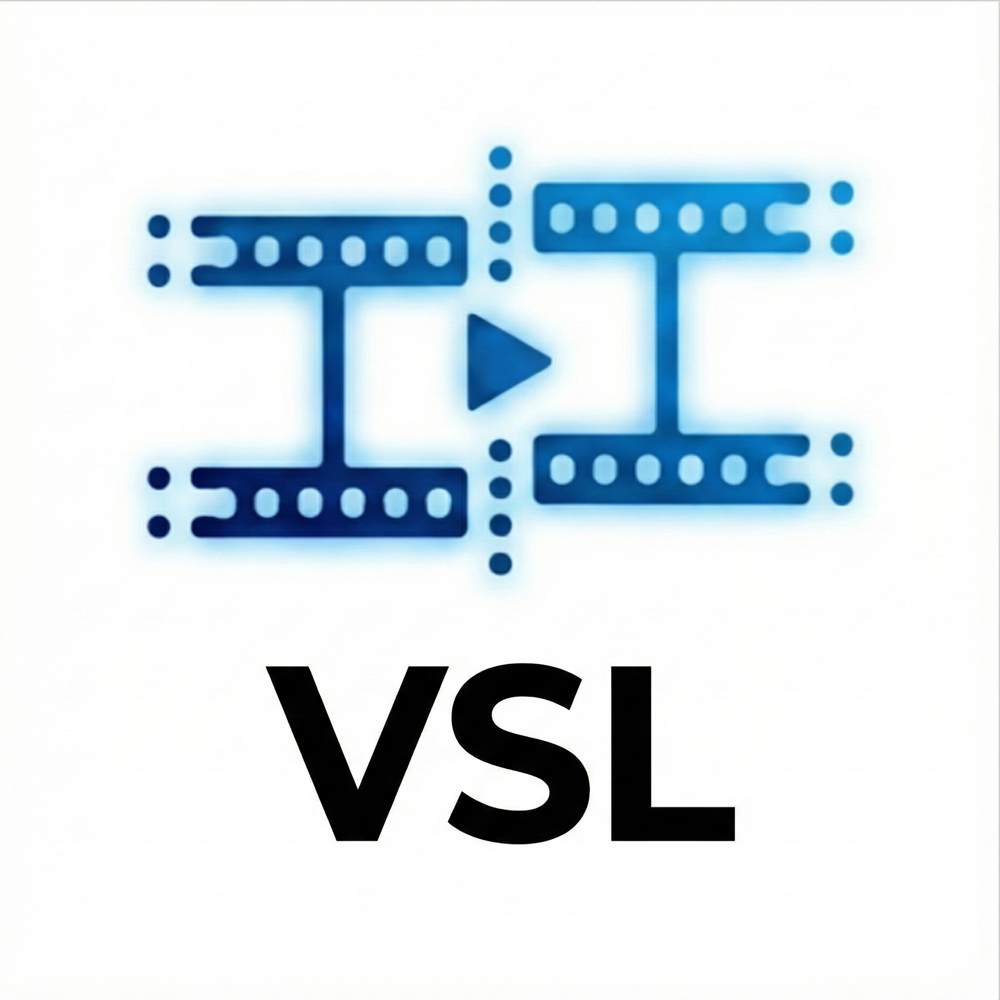

1\. VideoSyncLab

動画同期・トリミング

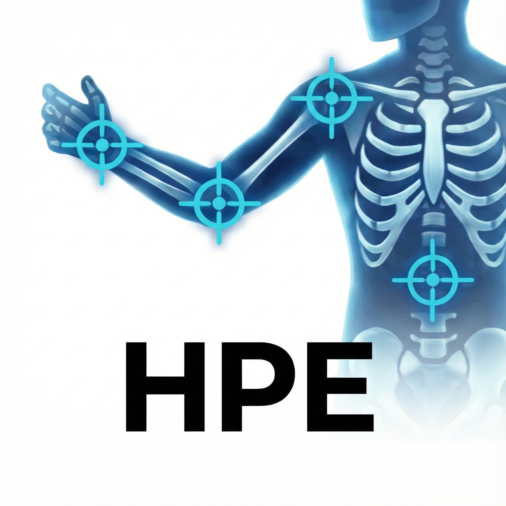

2\. HPE

AI骨格推定

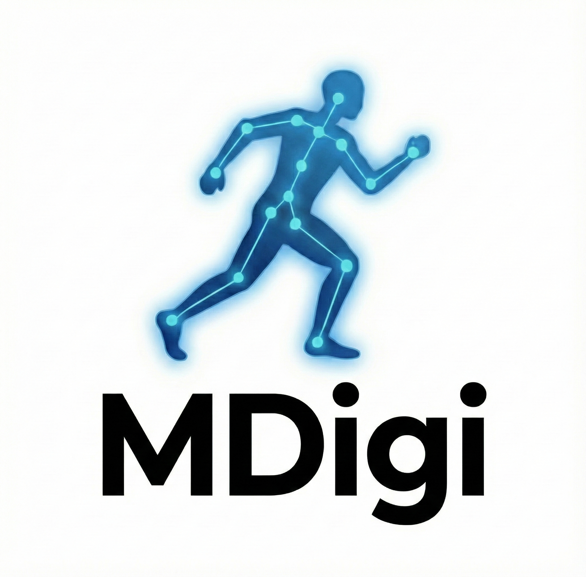

3\. MotionDigitizer

精密デジタイズ  
キャリブレーション

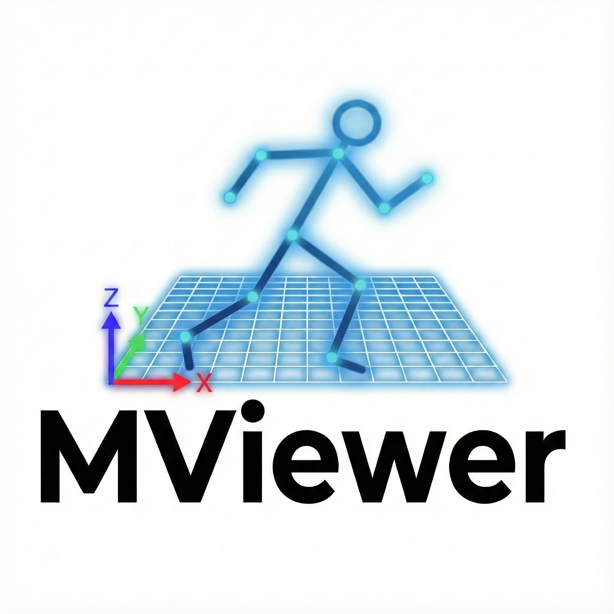

4\. MotionViewer

動作分析・可視化

*   [1 VideoSyncLab — 動画同期・編集](#videosynclab)
*   [2 HPE — AI骨格推定](#hpe)
*   [3 MotionDigitizer — 精密デジタイズ](#motiondigitizer)
*   [4 MotionViewer — 動作分析](#motionviewer)
*   [5 ショートカットキー一覧](#shortcut-ref)
*   [6 ファイル形式リファレンス](#file-format-ref)
*   [7 トラブルシューティング](#troubleshooting)

## STEP 1: VideoSyncLab 動画同期・編集

**目的:** 複数台のカメラで撮影した動画の時間軸を完全に一致させ、分析に必要な区間だけを切り出します。ストロボモーション合成機能も搭載。

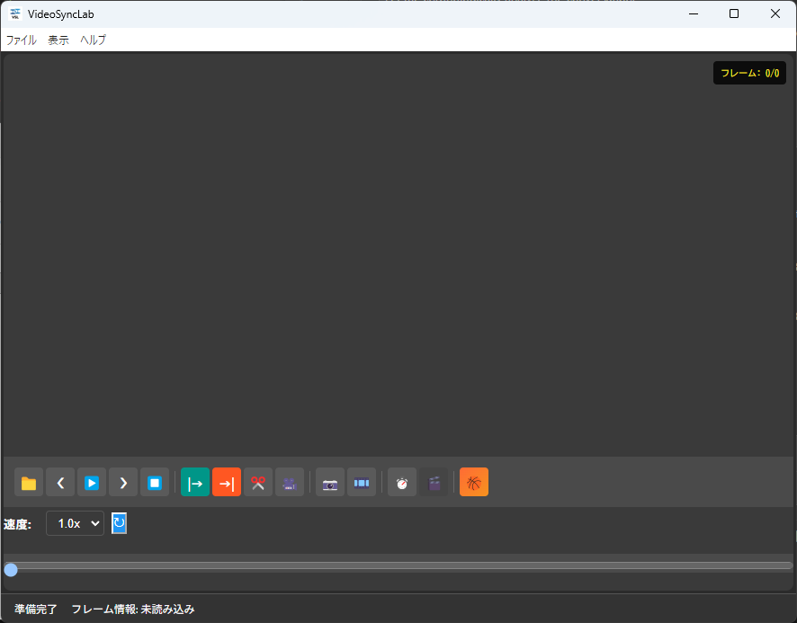

**シングルスクリーン** 1台のカメラ映像を表示するモード

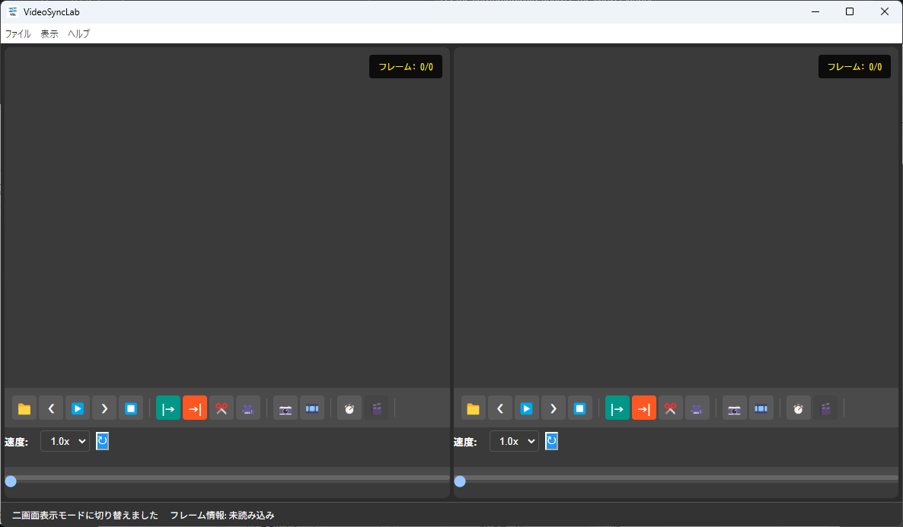

**デュアルスクリーン** 2台のカメラ映像を並べて同期

### 1.1 動画の読み込み

1.  メニューバーの ファイル 動画1を開く（Ctrl+1）を選択し、1台目の動画（例：正面カメラ）を読み込みます。
2.  2台目を読み込むには ファイル 動画2を開く（Ctrl+2）を選択します。読み込み後、自動的にデュアルビュー（左右分割）に切り替わります。
3.  または、動画ファイルを左右いずれかのエリアに直接 **ドラッグ＆ドロップ** して読み込むこともできます。

**Tip:** 対応形式は MP4, MOV, AVI, MKV, WebM など FFmpeg 対応の全動画形式です。動画の動きがカクつく場合は、メニューの ファイル 動画1を最適化して再読み込み を使うとスムーズに再生できます。

### 1.2 画面表示モード

メニューバーの 表示 メニューから切り替えます。

#### シングルスクリーン

動画1のみをフル画面で表示します。1台のカメラのみ使う場合に最適。

#### デュアルスクリーン

左右に2つの動画を並べて表示。同期作業には必須のモードです。

### 1.3 再生操作

各プレーヤーの下部にあるコントロールバーで操作します。

ボタン

名称

操作

📁

ファイルを開く

ファイル選択ダイアログを開いて動画を読み込みます。

❮

1コマ戻し

1フレーム前に戻ります。長押しで連続コマ戻し。

▶️

再生 / 一時停止

動画を再生または一時停止します。

❯

1コマ送り

1フレーム先に進みます。長押しで連続コマ送り。

⏹

停止

再生を停止し、先頭フレーム（フレーム0）に戻ります。

#### 再生速度の変更

コントロールバー下の **速度ドロップダウン** から選択できます。

選択可能: `0.1x` / `0.25x` / `0.5x` / `1.0x`（標準）/ `1.5x` / `2.0x` / `4.0x`

キーボードの ↑ ↓ でもリアルタイムに速度変更可能です。

#### ズーム＆パン

**マウスホイール** で動画を拡大縮小（10%〜500%）。拡大中は **マウスドラッグ** でパン操作ができます。

コントロールバーの ↻（ズームリセット）ボタンで初期表示に戻ります。

### 1.4 2台のカメラ同期

これがVideoSyncLabの核心機能です。左右の動画の「同じ瞬間」を1フレーム単位で合わせます。

1.  **左動画** を操作し、同期の基準となる瞬間（例：ボールリリース、クラップ音のフレーム）を探し出します。← → キーで1コマずつ確認してください。
2.  基準フレームが決まったら、左プレーヤーの ⏱️ **同期ポイント設定** ボタンをクリックします。
3.  同様に、**右動画** で同じ瞬間のフレームを探し、右プレーヤーの ⏱️ をクリックします。
4.  両方の同期ポイントが設定されると、**自動的に同期モード** が有効になります。
    *   左プレーヤーが「親」、右プレーヤーが「子」になります。
    *   左側の再生・コマ送り操作に右側が自動追従します。
    *   右側のコントロールは自動的に無効化されます。
    *   タイムラインに緑色の **同期再生可能範囲** が表示されます。

**Tip:** 同期を解除するには、どちらかの ⏱️ ボタンをもう一度クリックします。右側のコントロールが再び有効になります。

### 1.5 トリミング（動画の切り出し）

分析に必要な区間だけを切り出して保存します。

1.  開始点にしたいフレームに移動し、|→ **トリミング開始点** ボタンをクリックします。タイムライン上にマーカーが表示されます。
2.  終了点にしたいフレームに移動し、→| **トリミング終了点** ボタンをクリックします。開始〜終了の範囲がタイムラインに色で示されます。
3.  出力方法を選択します。
    
    ✂️
    
    **スマートカット**
    
    再エンコードなし。画質劣化ゼロで高速に切り出し。**通常はこちらを推奨。**
    
    🎥
    
    **再エンコード**
    
    H.264で再エンコード。ファイルサイズを小さくしたい場合やコーデック変換が必要な場合に使用。
    
4.  出力ファイルは元動画と同じフォルダに `*_cut.mp4` または `*_encoded.mp4` として保存されます。

### 1.6 フレーム書き出し

📷

**フレーム保存**

現在表示中のフレームをPNG画像として保存します。プレゼン資料作成やフォーム確認に。

🎞️

**連番フレーム出力**

トリミング範囲のフレームを連番PNGとして一括出力します。ストロボモーション素材としても使えます。

### 1.7 二画面動画出力

同期モード有効時に使用可能になります。

1.  同期モードを有効にします（1.4参照）。
2.  左右両方でトリミング範囲を設定します。
3.  🎬 **二画面動画出力** ボタン（同期モード時のみ有効化）をクリックすると、左右の動画を横並びにした1本の動画が `*_dual.mp4` として出力されます。

### 1.8 ストロボモーション

複数フレームの動きを1枚の画像に合成する、スポーツ分析で定番のビジュアライゼーションです。

1.  🏀 **ストロボモーション** ボタンをクリックすると、フローティングコントロールパネルが表示されます。
2.  **選択ツール** を使って、動画上でキャプチャ範囲を指定します。
    *   **矩形ツール:** ドラッグで矩形選択。Shift 押しながらで正方形。Ctrl で中心基準。
    *   **楕円ツール:** ドラッグで楕円選択。Shift で正円。
    *   **投げ縄ツール:** フリーハンドでクリックして任意形状を作成。ダブルクリックで確定。
3.  キャプチャ方法を選択します。
    *   **手動キャプチャ:** 範囲を選択してから「キャプチャ」で1フレーム取得。コマ送りして繰り返し。
    *   **AIキャプチャ:** AI（ONNX セグメンテーション）で人物を自動切り抜き。
4.  **設定パネル** で合成パラメータを調整します。
    *   **不透明度** (0〜100%): 各フレーム画像の透過率。
    *   **フェードモード:** 全フレーム均一 or 古いフレームほど薄く（フェードアウト）。
    *   **ブレンドモード:** source-over / multiply / screen など。
    *   **背景:** 元映像 / 透明 / 黒 / 白。
    *   **背景差分:** 動いている人物だけを抽出（閾値調整可能）。
5.  **「生成」** ボタンで合成画像をプレビュー。結果は **画像保存**（PNG）または **動画保存**（MP4）で出力できます。

### 1.9 プロジェクト管理

作業状態を保存して後から再開できます。

*   ファイル プロジェクトを保存（Ctrl+S）: 現在の状態を `.vsl` ファイルに保存。
*   ファイル プロジェクトを開く（Ctrl+O）: 保存済みプロジェクトを復元。動画パス・トリミング・同期点がすべて復元されます。

### 1.10 キーボードショートカット

キー

操作

Space

再生 / 一時停止

←

1コマ戻し（長押しで連続）

→

1コマ送り（長押しで連続）

↑

再生速度を上げる

↓

再生速度を下げる

Ctrl+1

動画1を開く

Ctrl+2

動画2を開く

Ctrl+O

プロジェクトを開く

Ctrl+S

プロジェクトを保存

Ctrl+W

動画を閉じる

## STEP 2: HPE AI骨格推定

**目的:** YOLO（人物検出）+ rtmlib（骨格推定：RTMPose / SynthPose）の2段AIパイプラインで、マーカーレスで身体の関節ポイントを自動追尾し、座標データを生成します。計測プリセットにより23点（高速・高精度）または52点（バイオメカニクス精密）を選択できます。

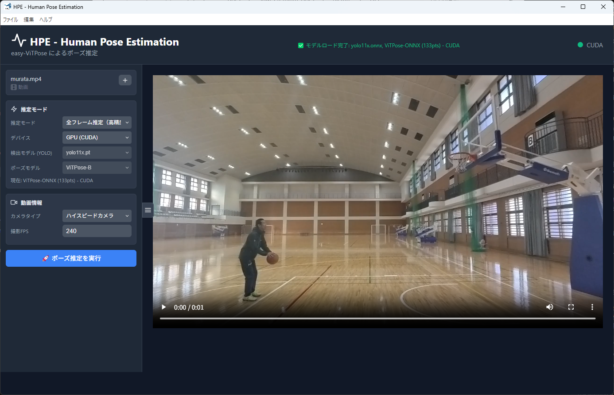

**モデルロード完了** YOLO + RTMPose/SynthPose準備完了状態

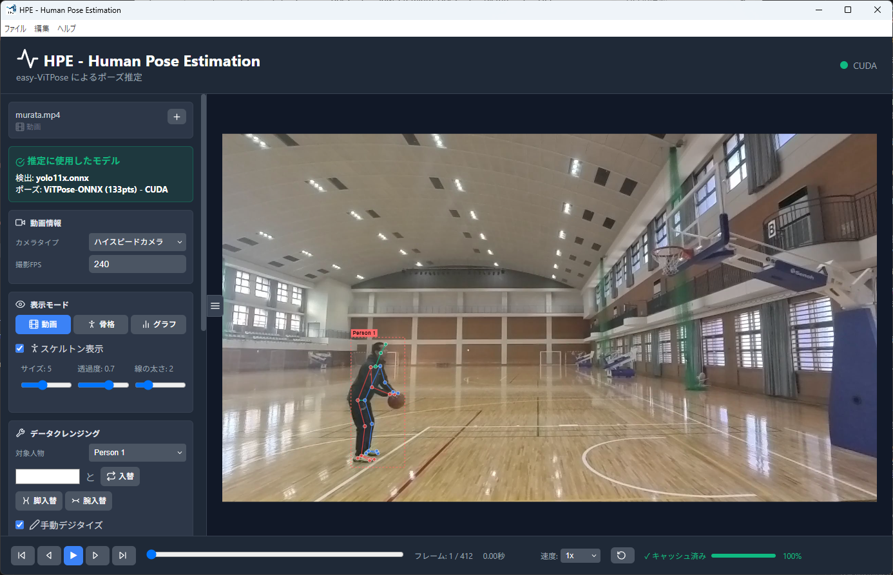

**推定結果 - 動画モード** 骨格オーバーレイ表示

### 2.1 ファイルの読み込み

1.  画面中央の **ドロップゾーン** にファイルをドラッグ＆ドロップ、またはクリックしてファイル選択ダイアログを開きます。
2.  メニューの ファイル 動画読み込み（Ctrl+O）でも読み込めます。

#### 対応ファイル形式

#### 動画

MP4, AVI, MOV, MKV, WebM, FLV, WMV, M4V, 3GP, MPEG

#### 画像

JPG, JPEG, PNG, GIF, BMP, WebP

### 2.2 推定設定

右サイドバーで推定パラメータを設定します。

#### 推定モード

**全フレーム推定（高精度）**

全フレームに対してAI処理を実行。時間はかかるが最も精度が高い。**推奨。**

**簡易推定（4フレームごと）**

4フレームに1回だけ推定。プレビュー確認や試行用。約4倍高速。

#### デバイス選択

**GPU (CUDA)**

NVIDIA GPU搭載機で自動検出されます。処理速度が大幅に向上。

**CPU**

全てのPCで利用可能。GPU非搭載時はこちらで動作します。

#### 計測プリセット

用途に合わせてプリセットを選択します。プリセットはモデルと出力形式を一括で設定します。

プリセット | ポーズモデル | 出力点数 | 特徴
---|---|---|---
**23点（RTMPose-M・高速）** | RTMPose-M | 23点 | 高速処理。大量ファイルのバッチ処理向け。
**23点（RTMPose-X・高精度）** | RTMPose-X | 23点 | 標準精度。通常分析の推奨設定。
**52点（SynthPose-Huge）** | SynthPose-Huge ONNX | 52点 | OpenCapBench形式。OpenSim連携・精密バイオメカニクス解析向け。

**検出モデル (YOLO)** はプリセットに応じて自動選択されます（高速：`yolo11s.onnx` / 高精度・52点：`yolo11x.onnx`）。

#### 動画情報設定

サイドバーでカメラ種別と録画FPSを指定できます。ハイスピードカメラ使用時は正しいFPSの入力が重要です。

### 2.3 推定の実行

1.  上記の設定を確認し、**「ポーズ推定を実行」** ボタンをクリックします。
2.  プログレスバーがリアルタイムで進行状況を表示します（フレーム数とパーセンテージ）。
3.  処理完了後、動画上に骨格がオーバーレイ表示されます。

**注意:** GPU (CUDA) 使用時でも、初回実行はモデルのロードに時間がかかります。2回目以降はキャッシュにより高速化されます。

### 2.4 表示モードの切り替え

推定完了後、3つの表示モードを切り替えて結果を確認できます。

#### 動画モード

元の動画に骨格をオーバーレイ表示。トラッキングの正確さを直感的に確認。

#### 骨格モード

スケルトンのみを表示。背景なしで骨格の動きだけに集中できます。

#### グラフモード

各キーポイントのX/Y座標を時系列グラフで表示。外れ値やジャンプの発見に有効。

#### 骨格の表示設定

サイドバーで以下を調整できます。

*   **スケルトン表示:** ON/OFF チェックボックス
*   **ポイントサイズ:** 1〜12ピクセル
*   **透過度:** 0.1〜1.0
*   **線の太さ:** 1〜10ピクセル

### 2.5 データクレンジング（修正）

AIは完璧ではありません。オクルージョン（隠れ）やID入れ替わりが発生した場合、ここで修正します。

#### ID操作

複数人物が交差した際にIDが入れ替わることがあります。以下のボタンで修正します。

**ID入替**

2人の人物のIDを手動で入れ替えます。交差後の追跡ミスの修正に。

**脚入替**

左右の脚のキーポイントを入れ替えます。AIが左右を誤認した場合に。

**腕入替**

左右の腕のキーポイントを入れ替えます。

#### 手動デジタイズ

AIが明らかに誤検出しているフレームでは、手動で正しい位置をクリックして修正できます。

1.  「デジタイズ有効」をONにします。
2.  モードを選択: **フレームデジタイズ**（各フレームのキーポイントを打つ）または **ポイント移動**（既存のポイントをドラッグ移動）。
3.  修正したいキーポイントをドロップダウンから選択します。
4.  動画上で正しい位置をクリックします。

### 2.6 グラフモードでの編集

グラフ表示モードでは、データの視覚的な確認と直接編集が可能です。

#### 一覧モード

全キーポイントの座標グラフを一覧で表示。異常なジャンプを発見できます。

#### 詳細モード

選択したキーポイントのX/Y座標グラフを拡大表示。

**以前削除**

現在フレームより前のデータをすべて削除。

**以降削除**

現在フレームより後のデータをすべて削除。

**フレーム削除**

現在フレームの選択人物データを削除。

**人物削除**

選択した人物を全フレームから削除。

**元に戻す / やり直し**

編集操作を取り消しまたはやり直し。

**編集リセット**

全編集を破棄し、AI推定直後の状態に戻します。

### 2.7 フィルタリング

データの品質を向上させるための信号処理フィルタ群です。サイドバーのフィルタリングパネルで設定します。

フィルタ | 説明
---|---
**外れ値除去** | 異常に大きく飛んだデータポイントを自動検出・除去。速度・加速度・Zスコアの3方式を組み合わせ。
**補間** | 欠損データを補間で埋めます。方式選択: `PCHIP`（推奨）/ `Cubic Spline` / `Akima` / `Linear`
**左右脚・腕自動修正** | AIの左右誤認を統計的に自動修正。複数の検出アルゴリズムを搭載（後述）。
**Butterworth Filter** | ローパスフィルタでノイズ除去。カットオフ周波数: 0.1〜30 Hz で調整。
**Kalman Smoother** | カルマンフィルタによる高度な平滑化。

設定後、**「フィルタ適用」** ボタンで一括処理されます。

#### フィルタ処理の実行順序

フィルタは以下の順序で適用されます。この順序は精度のために重要です。

```
1. 左右スワップ修正  →  2. 外れ値除去  →  3. 補間  →  4. Butterworth
```

> スワップ（左右入れ替わり）が先に修正されることで、スワップによる「見かけ上の外れ値」が誤削除されるのを防ぎます。

#### 左右スワップ検出アルゴリズム（4種類）

設定パラメータ `swap_detection_method` で切り替えられます。

アルゴリズム | 説明 | 推奨用途
---|---|---
**global_optimization**（デフォルト） | 動的計画法で軌跡全体を最適化。最も精度が高い。 | 標準的な動作全般
**trajectory_prediction** | 過去の軌跡から次位置を予測し乖離を検出。 | 高速移動（スプリント等）
**temporal_window** | 時間窓で平滑化して検出。 | 従来互換
**legacy** | フレーム間距離比較のみ。 | 互換性維持

#### FPS適応型検出閾値

フレームレートに応じて速度閾値が自動調整されます（誤検出防止）。

| FPS | 速度閾値（px/frame） |
|-----|---------------------|
| 60fps | 25.0 |
| 120fps | 12.5 |
| 240fps | 6.25 |

#### 交差フェーズ検出

ランニング中など脚が交差するフェーズを自動検出し、左右スワップの誤検出を抑制します。股関節・膝の水平距離から判定。

### 2.8 エクスポート

サイドバーのエクスポートパネルから、対象人物と形式を選んで出力します。

形式

用途

**CSV形式で保存**

フレームごとの関節座標データ。**MotionDigitizerへの入力データ**として使用。精度は設定で0〜6桁。

**YOLO学習データ作成**

切り出し画像＋アノテーションをYOLO形式で出力。検出モデルの追加学習用。

**オーバーレイ動画を保存**

骨格を描画した動画（MP4）または画像（PNG）を出力。プレゼンテーションや報告書に。

### 2.9 バッチ処理

複数の動画ファイルを連続して自動処理し、各ファイルに対して `.hpe` プロジェクトファイルを自動保存します。大量データの一括処理に使用します。

#### バッチ処理の手順

1.  メニューの **ファイル → バッチ処理** を選択します。
2.  **「ファイルを選択…」** ボタンをクリックし、処理する動画ファイルを複数選択します。
3.  以下の設定を行います。

設定項目 | 説明
---|---
**カメラタイプ** | 通常カメラ / ハイスピードカメラを選択
**撮影FPS** | 録画フレームレートを入力（ハイスピード時に重要）
**ポーズモデル** | `RTMPose-M`（高速）/ `RTMPose-X`（高精度）/ `SynthPose-Huge`（52点）から選択
**推定モード** | 全フレーム推定（推奨）/ 簡易推定（4フレームごと）

4.  **「処理開始」** ボタンをクリックします。各ファイルの処理完了後、動画と同じフォルダに `.hpe` ファイルが自動保存されます。

> **Tip:** 52点（SynthPose-Huge）選択時は左右腕・下肢の入れ替え（スワップ修正）も自動適用されます。処理後にフィルタリングパネルから追加調整も可能です。

### 2.10 プロジェクト管理

*   Ctrl+S: 上書き保存（`.hpe` プロジェクトファイル）
*   Ctrl+Shift+S: 名前を付けて保存
*   Ctrl+Shift+O: プロジェクトを読み込み（`.hpe` / `.json`）
*   Ctrl+W: プロジェクトを閉じる

**Tip:** `.hpe` ファイルには推定結果・フィルタ設定・編集履歴がすべて含まれます。動画パスは相対/絶対パスが自動判別されるため、フォルダ移動後もプロジェクトを開くことができます（動画が見つからない場合は再リンクダイアログが表示されます）。

### 2.11 再生コントロール

画面下部のフッターバーに配置されています。

⏮

先頭フレームへジャンプ

⏪

前のフレーム

▶️

再生 / 一時停止

⏩

次のフレーム

⏭

最終フレームへジャンプ

再生速度: `0.25x` / `0.5x` / `1x` / `2x` / `4x` / `8x` / `16x`

### 2.11 キーボードショートカット

キー

操作

Space

再生 / 一時停止

←

前のフレーム

→

次のフレーム

Ctrl+O

動画読み込み

Ctrl+Shift+O

プロジェクト読み込み

Ctrl+S

上書き保存

Ctrl+Shift+S

名前を付けて保存

Ctrl+W

プロジェクトを閉じる

Ctrl+Z

元に戻す（Undo）

Ctrl+Y

やり直し（Redo）

## STEP 3: MotionDigitizer 精密デジタイズ

**目的:** AIの推定データを人間が確認・補正し、キャリブレーション（空間定義）を適用して2D座標を現実世界の3D座標（メートル単位）に変換します。8種類のキャリブレーション手法を搭載。

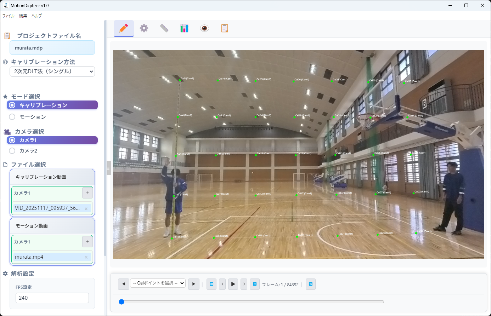

**キャリブレーションモード** 制御点を設定して空間を定義

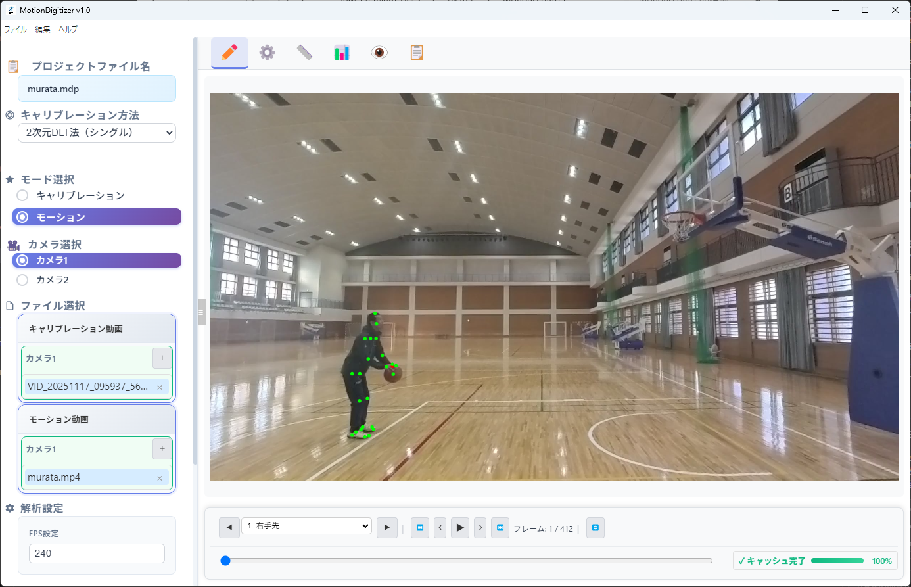

**モーションデジタイズ** 骨格ポイントを手動/自動で追跡

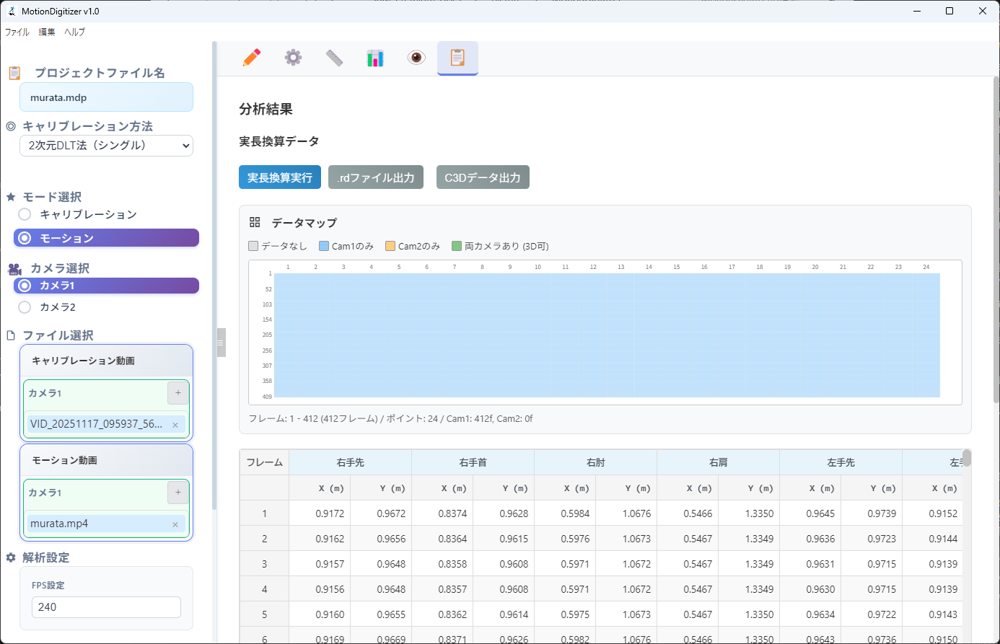

**分析結果タブ** 実長換算データとエクスポート

### 3.1 画面構成（6つのタブ）

MotionDigitizerは6つのタブで構成されています。左から順に作業を進めます。

#### デジタイズ

動画を再生しながらポイントをクリックしてデジタイズ。メインの作業画面。

#### ポイント設定

関節名（ランドマーク名）の定義と管理。

#### キャリブレーション

カメラパラメータの算出。DLT法、CC法、ChArUco法など。

#### モーションデータ

数値テーブルの閲覧・編集・インポート。

#### プレビュー

マルチカメラ映像の同時プレビュー。

#### 分析結果

キャリブレーション結果・実長換算結果の表示。

### 3.2 プロジェクトの作成

1.  ファイル 新規プロジェクト（Ctrl+N）を選択し、プロジェクトファイル名と保存場所を指定します。
2.  プロジェクトは `.mdp` 形式で保存されます。動画のパスは相対パスで管理されるため、プロジェクトフォルダごと移動しても動作します。

### 3.3 キャリブレーション（空間定義）

映像のピクセル座標を現実世界のメートル座標に変換するための数学的基盤を作ります。

#### 利用可能な手法（8種類）

手法

用途

**4点実長換算**

最も簡単。既知の4点の距離から2Dスケールを算出。

**2次元DLT法（シングル）**

1台のカメラで2D平面内の座標を高精度に変換。

**3次元DLT法**

2台以上のカメラで3D空間座標を算出。古典的かつ信頼性の高い手法。

**3次元CC法（競技場特徴点）**

競技場のラインや特徴点を利用。屋外・試合映像向け。

**ChArUcoボード法（ステレオ）**

ChArUcoボードを使った高精度ステレオキャリブレーション。

**2次元DLT法（ステレオ）**

2台のカメラでDLTステレオキャリブレーション。

**ChArUcoボード法（シングル）**

1台のカメラのレンズ歪み補正に。

**Vicon XCP（三角測量）**

Viconシステムのキャリブレーションファイルを読み込み、三角測量で3D化。

#### DLT法の基本ワークフロー

1.  「キャリブレーション」タブを開き、手法ドロップダウンから目的の手法を選択します。
2.  キャリブレーション映像（既知の長さを含む映像）を読み込みます。
3.  画面上で制御点（コントロールポイント）をクリックしてデジタイズします。
4.  右パネルの実空間座標テーブルに、各制御点の実距離（X, Y, Z メートル）を入力します。
5.  **「カメラ定数」** ボタンをクリックして計算を実行します。

#### ChArUcoボードキャリブレーション

1.  ボードの仕様を設定: 縦数、横数、チェッカーサイズ(mm)、マーカーサイズ(mm)。
2.  **「セッション開始」** をクリック。
3.  ボードが映ったフレームで **「現在フレームを追加」** をクリックしてサンプルを追加します（または **「自動開始」** でAIが最適なフレームを自動選択）。
4.  十分なサンプル数が集まったら **「キャリブレーション実行」** をクリック。RMS誤差が表示されます。

#### CC法（競技場特徴点法）

1.  手法ドロップダウンで「3次元CC法（競技場特徴点）」を選択。
2.  2台のカメラの映像を読み込み。
3.  競技場の既知の特徴点（ラインの交点、コーナーなど）をデジタイズ。
4.  初期カメラ位置 (X0, Y0, Z0) を設定。
5.  最適化モード（Auto / P3P / GA）を選択。
6.  必要に応じて内部パラメータ（レンズ歪み）JSONを読み込み。
7.  **「CC法キャリブレーション実行」** をクリック。

### 3.4 HPEデータのインポート

1.  「モーションデータ」タブを開きます。
2.  **「HPEインポート」** ボタンをクリックし、HPE (STEP 2) で出力したCSVまたはHPEプロジェクトファイルを選択します。
3.  AIの推定座標がモーションデータテーブルに読み込まれます。
4.  外れ値や欠損値は **「補間」** ボタン（スプライン補間）で自動修復できます。

**Tip:** **「CSVインポート」** ボタンでは、他のモーションキャプチャシステムからのCSVデータも読み込めます。

### 3.5 手動デジタイズ

「デジタイズ」タブのメイン作業です。AIデータの補正や、ゼロからのデジタイズに使います。

1.  「デジタイズ」タブで動画を読み込み、目的のフレームに移動します。
2.  ポイント選択パネルで、デジタイズする関節名を選択します（↑ ↓ で切替可能）。
3.  動画上の正しい位置をクリックします。座標がテーブルに記録されます。
4.  次のポイントに自動的に切り替わります。すべてのポイントを打ち終えたら、フレームが自動的に進みます。

#### デジタイズ設定

**ポイント名表示**

キャンバス上にポイント名を表示。ON/OFF切替。

**ポイントサイズ**

クリック点の表示サイズ。1〜20ピクセル。

**軌跡表示**

各ポイントの移動軌跡を表示。動きの流れを確認できます。

**リバースデジタイズ**

通常と逆方向（終了→開始）にフレームを進めてデジタイズ。

**デジタイズ間隔**

デジタイズ後のフレーム送り幅。1〜20フレーム。

### 3.6 テーブル操作

モーションデータテーブルはスプレッドシートのように操作できます。

📈

**補間**

選択範囲の欠損セルをスプライン補間で自動補完。

🗑️

**削除**

選択セルのデータを削除。

📋

**コピー** (Ctrl+C)

選択セルをクリップボードにコピー（タブ区切り）。Excel等に貼り付け可能。

📄

**貼付** (Ctrl+V)

クリップボードからデータを貼り付け。

☑️

**全選択** (Ctrl+A)

テーブル全体を選択。

↩️

**元に戻す** (Ctrl+Z)

直前の操作を取り消し（最大50回）。

↪️

**やり直し** (Ctrl+Y)

取り消した操作をやり直し。

### 3.7 実長換算とエクスポート

1.  キャリブレーション完了後、デジタイズデータが揃ったら **「実長換算実行」** をクリックします。
2.  全フレームのデータがピクセル座標から実空間座標（メートル単位）に変換されます。
3.  以下の形式で出力できます。

形式 | 用途
---|---
**.rd ファイル** | Reality Data形式。MotionViewerへの入力データ。
**C3D** | 国際標準モーションキャプチャ形式。他ソフトとの互換性。
**TRC** | OpenSim 用マーカー軌跡形式。Inverse Kinematics の入力に使用。

### 3.8 CSVインポート詳細

**「CSVインポート」** ボタンで、HPEが出力したCSVファイルを直接読み込めます。

#### ポイント数の自動拡張

CSVのヘッダー列（`_x` / `_y` ペア）を走査し、現在のプロジェクトのポイント数より多い場合は **自動的にポイントを追加** します。

- 例: プロジェクトに23点 → CSVに52点 → 差分の29点が自動追加される
- 追加されたポイント名はCSVのヘッダー名がそのまま使われる
- カテゴリーは「インポート」として登録される

#### ポイント名の自動上書き

CSVの列順にポイントが割り当てられ、既存ポイントの名前もCSVのヘッダー名に更新されます。

> **注意:** インポート後に「元に戻す」（Ctrl+Z）でポイント名・データを一括復元できます。

#### 対応CSVフォーマット

```
frame, Nose_x, Nose_y, L_Eye_x, L_Eye_y, ..., Nose_conf, ...
1, 1888.1, 999.2, 1881.1, 988.4, ..., 0.932, ...
```

- 1列目: フレーム番号
- `{PointName}_x` / `{PointName}_y` のペアが座標列
- `_conf` などの信頼度列は自動的に無視される

### 3.9 OpenSim 連携（TRC エクスポート）

MotionDigitizerで計測した3D座標データを、筋骨格シミュレーションソフト **OpenSim** で使用できるTRCファイルとして出力できます。

#### OpenSimワークフロー概要

```
MotionDigitizer（TRC出力）
         │
         ├── OpenSim: Scale Tool ──→ スケール済みモデル (.osim)
         │          └── 静止姿勢TRC を使って体型に合わせてスケーリング
         │
         └── OpenSim: Inverse Kinematics ──→ 関節角度データ (.mot)
                    └── 動作TRC + スケール済みモデル → 骨格アニメーション
```

#### TRC出力の操作手順

1. 実長換算を実行して3D座標データを生成する
2. 「分析結果」タブを開く
3. 必要に応じて下記オプションを設定する
4. **「TRC出力 (OpenSim)」** ボタンをクリックして保存する

#### オプション設定

オプション | 説明
---|---
**OpenSim用マーカー名に変換** | 日本語ポイント名をOpenSim標準英語名に変換（例: 右肘 → R.Elbow）。`opensim_marker_map.json` でカスタマイズ可能。
**OpenSim座標軸変換** | カメラ座標系をOpenSim座標系に変換（デフォルト ON）。スケルトンが正立するために必須。
**マップ読み込み** | カスタムマーカー名マッピングJSONを手動で読み込む。

#### 座標軸変換について

カメラ映像で取得した3D座標とOpenSimの座標系は異なります。

| 軸 | カメラ座標系 | OpenSim座標系 |
|---|---|---|
| X | 左右（lateral） | 前後（forward） |
| Y | 奥行き（depth） | 上下（up）← Y-up |
| Z | 高さ（up） | 左右（lateral） |

変換式: `X_new = Y_old`, `Y_new = Z_old`, `Z_new = X_old`

この変換を適用しないと、OpenSim上でスケルトンが横倒しになります。

#### OpenSimでの使い方

**Scale Tool（モデルのスケーリング）:**

1. 静止姿勢を撮影し、TRCファイルとして出力（例: `subject_static.trc`）
2. OpenSim → Tools → Scale Model
3. 静止姿勢TRCを `Marker File` に指定して Run
4. スケール済みモデル（`subject_scaled.osim`）が生成される

**Inverse Kinematics（関節角度の算出）:**

1. 動作TRCファイルを出力（例: `subject_motion.trc`）
2. OpenSim → Tools → Inverse Kinematics
3. スケール済みモデルと動作TRCを指定して Run
4. 関節角度データ（`ik_result.mot`）が生成され、スケルトンがアニメーションする

> **ヒント:** `opensim_toolkit.py`（MotionDigitizerフォルダに同梱）を使えば、Scale・IK のセットアップXMLを自動生成できます。52点マーカーに対応した測定セット（大腿長・下腿長・上腕長など）が自動で定義されます。

#### マーカー名マッピング（opensim_marker_map.json）

```json
{
  "Nose":        "Nose",
  "r_ankle":     "R.Ankle",
  "l_ankle":     "L.Ankle",
  "r_knee":      "R.Knee",
  "l_knee":      "L.Knee",
  "r_ASIS":      "R.ASIS",
  "l_ASIS":      "L.ASIS"
}
```

左辺がCSV/プロジェクトのポイント名、右辺がOpenSimモデルのマーカー名。不一致のマーカーはOpenSimで自動的に無視されます。

### 3.10 キーボードショートカット

キー

操作

Space

再生 / 一時停止

←

前のフレーム

→

次のフレーム

↑

前のポイント

↓

次のポイント

Backspace

1フレーム戻る

Ctrl+N

新規プロジェクト

Ctrl+O

プロジェクトを開く

Ctrl+S

上書き保存

Ctrl+Shift+S

名前を付けて保存

Ctrl+Z

元に戻す

Ctrl+Y

やり直し

Ctrl+C

コピー

Ctrl+V

貼り付け

Ctrl+A

全選択

## STEP 4: MotionViewer 動作分析・可視化

**目的:** 3D座標データを読み込み、スティックピクチャ（骨格線画）の3D表示、速度・角度のグラフ分析、身体重心（COM）の算出を行います。動画・画像・SVGによるエクスポートにも対応。

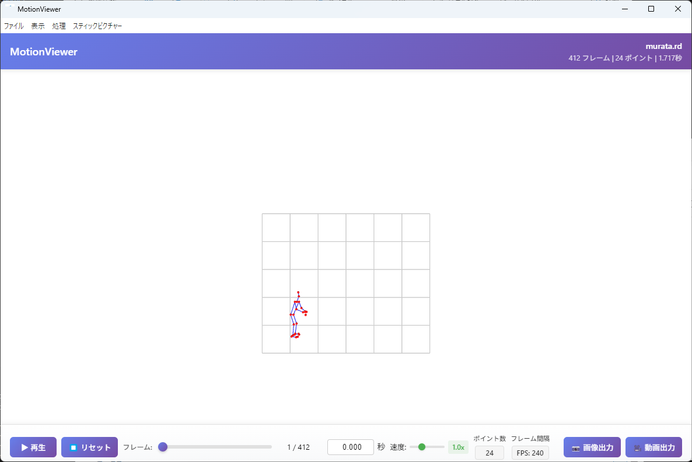

**スティックピクチャ表示** 骨格をリアルタイムで3D表示

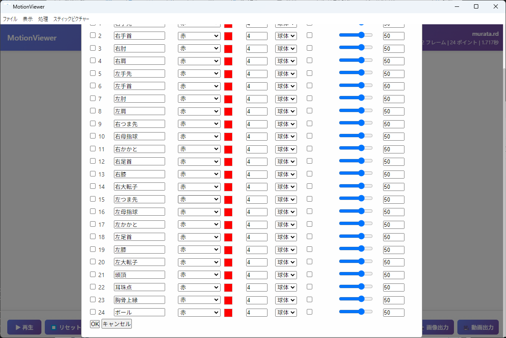

**ポイント設定ダイアログ** 色・サイズ・形状をカスタマイズ

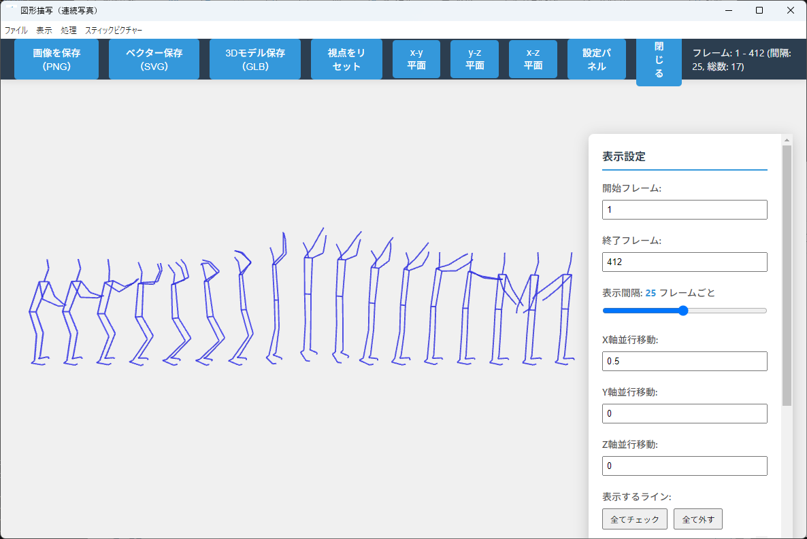

**連続写真（図形描写）** 動きの軌跡を一覧表示

### 4.1 データの読み込み

1.  ファイル ファイルを開く（Ctrl+O）でモーションデータを読み込みます。ドラッグ＆ドロップにも対応。
2.  対応形式: `.3d`（3Dデータ）/ `.2d` / `.rd` / `.sd`（2Dデータ）
3.  読み込み後、中央の3Dビューアにスティックピクチャが表示されます。

#### ファイル形式の仕様

テキストベースのCSV形式です。

1行目: フレーム数, ポイント数, フレーム間隔（秒）
2行目～: x1,y1,z1, x2,y2,z2, ... xN,yN,zN  （1フレームの全座標）

例: フレーム間隔 `0.004` = 250Hz、`0.033` = 30Hz

### 4.2 3Dビューアの操作

操作

方法

**回転**

左マウスドラッグ。データの中心を軸に自由に回転できます。

**移動（パン）**

中ボタンドラッグ、または Ctrl＋左マウスドラッグ。

**拡大縮小（ズーム）**

マウスホイール。

**正面ビュー**

メニュー: 表示 y-z 平面

**側面ビュー**

メニュー: 表示 x-z 平面

**上面ビュー**

メニュー: 表示 x-y 平面

### 4.3 スティックピクチャ設定

メニューの スティックピクチャー から身体モデルを選択します。

#### Body 23 Points

23関節モデル。体幹を1セグメントとして扱う標準モデル。

#### Body 25 Points

25関節モデル。体幹を上部/下部に分割。より詳細な分析に。

#### 慣性楕円体

各セグメントの慣性楕円体を表示。回転運動の可視化に。

#### 連続図 (Sequence Draw)

複数フレームのスティックピクチャを重ねて描画。動きの流れを1枚で把握。

### 4.4 ポイント・ラインの表示設定

メニューの 表示 ポイント設定 または ライン設定 で開きます。

#### ポイント設定

*   **全選択/全解除:** ポイントの一括表示制御。
*   **個別カラー:** カラーピッカーで各ポイントに固有色を割当。
*   **サイズ:** 0〜50ピクセル。
*   **パターン:** 球体やカスタム形状。
*   **表示/非表示:** 不要なポイントを個別に非表示。

#### ライン設定

*   **ラインの追加:** 任意の2点を結ぶラインを追加。
*   **色:** カラーピッカーで選択。
*   **太さ:** 1〜20ピクセル。
*   **スタイル:** 実線 / 点線 / 破線。

### 4.5 再生コントロール

画面下部のタイムラインバーで操作します。

▶️

**再生 / 一時停止**

Space キーでも操作可能。

⏹️

**リセット**

Home キーで先頭フレームに戻ります。

再生速度: ↑ キーで加速（最大5.0x）、↓ キーで減速（最小0.1x）。

フレームスライダーのドラッグ、または直接フレーム番号入力でジャンプ可能。

### 4.6 グラフ解析

表示 グラフ表示 でグラフパネルを開きます。

#### グラフの種類

グラフ種別

内容

**速度 (Velocity)**

各ポイントの速度の時系列変化。合成速度 / X成分 / Y成分 / Z成分 を選択可能。

**位置 (Position)**

X / Y / Z 各軸の位置座標の時系列変化。

**関節角度 (Joint Angle)**

指定した関節の角度変化。14種類の関節角度定義に対応。3Dビューア上に角度の円弧も表示。

**セグメント角度 (Segment Angle)**

身体セグメントの傾き角度。XY / YZ / XZ 平面を選択。

#### グラフ操作

*   **関節選択パネル:** 表示したいポイントにチェックを入れます。
*   **Y軸範囲:** 手動で最小値・最大値を入力可能。
*   **凡例:** ドラッグで移動、リサイズ可能。
*   **グラフ上クリック:** 対応するフレームにジャンプ。

### 4.7 身体重心 (COM) の算出

処理 身体重心計算 を選択します。

1.  **年齢区分** を選択:
    *   **成人 (Adult):** 阿江14/15の身体部分慣性係数 (BSP) を使用。
    *   **小児 (Child, 3-17歳):** 横井モデル。年齢と体型（痩身/標準/肥満）を指定。
    *   **高齢者 (Elderly, 65歳以上):** 岡田モデル。加齢変化を反映。
2.  **性別** を選択します（男性/女性で重心位置が異なります）。
3.  **身体モデル** を選択します。
    *   **23点モデル (Abe14):** 14セグメント。体幹を1つのセグメントとして扱う。
    *   **25点モデル (Abe15):** 15セグメント。体幹を上部/下部に分割。より正確。
4.  計算を実行すると、全フレームの身体重心が自動算出され、3Dビューア上にマーカーとして表示されます。

**Tip:** COMは追加ポイント (N+1番目) として扱われるため、グラフ分析で速度や位置の時系列変化を確認できます。投球・打撃・跳躍動作の重心移動分析に極めて有効です。

#### BSP（身体部分係数）モデル詳細

各セグメントの質量比・重心位置比は以下のモデルから選択されます。

モデル | 対象 | セグメント数 | 特徴
---|---|---|---
**阿江 (Abe) 成人モデル** | 日本人成人 | 14 or 15 | 標準。性別・年齢対応。
**横井 (Yokoi) 小児モデル** | 3〜17歳 | 14 | 年齢・体型（3区分）対応。
**岡田 (Okada) 高齢者モデル** | 65歳以上 | 14 | 加齢による体組成変化を反映。

#### 対応セグメント（14セグメント構成）

頭部・体幹・右上腕・左上腕・右前腕・左前腕・右手・左手・右大腿・左大腿・右下腿・左下腿・右足・左足

### 4.8 Butterworthフィルタ

処理 Butterworthフィルタ を選択します。

#### カットオフ周波数の設定

**自動 (Wells & Winter法)**

残差分析により最適なカットオフ周波数を自動決定。チャネルごとに最適値を計算。**通常はこちらを推奨。**

**手動**

0.1〜100 Hz の範囲で指定。先行研究の知見がある場合に。

#### オプション

**パディング（両端補正）:** データの端でフィルタによる歪みを抑制する反射パディング。パッド長を1〜200フレームで指定。

### 4.9 エクスポート

形式

内容

📷 **画像出力 (PNG)**

現在の3Dビューアのスクリーンショット。グラフオーバーレイ付き。

📷 **画像出力 (SVG)**

スティックピクチャをSVG（ベクター画像）で出力。論文・発表用に最適。拡大しても劣化なし。

🎥 **動画出力 (MP4)**

アニメーション全体を FHD (1920x1080) / 60fps のMP4動画で出力。3Dビュー＋グラフの分割表示も可能。

### 4.10 プロジェクト管理

*   Ctrl+N: 新規プロジェクト
*   Ctrl+Shift+O: プロジェクトを開く (`.mvp`)
*   Ctrl+S: 上書き保存
*   Ctrl+Shift+S: 名前を付けて保存
*   ファイル 設定を保存: 現在の表示設定をJSON形式でエクスポート
*   ファイル 設定を読み込み: JSON設定ファイルから表示設定をインポート

### 4.11 キーボードショートカット

キー

操作

Space

再生 / 一時停止

Home

先頭フレームへ

←

前のフレーム

→

次のフレーム

↑

再生速度を上げる（最大5.0x）

↓

再生速度を下げる（最小0.1x）

Ctrl+N

新規プロジェクト

Ctrl+O

ファイルを開く

Ctrl+Shift+O

プロジェクトを開く

Ctrl+S

上書き保存

Ctrl+Shift+S

名前を付けて保存

## ショートカットキー一覧（全アプリ共通リファレンス）

### 全アプリ共通

キー

操作

Space

再生 / 一時停止

←

前のフレーム

→

次のフレーム

Ctrl+S

プロジェクトを保存

Ctrl+Z

元に戻す（Undo）

Ctrl+Y

やり直し（Redo）

### VideoSyncLab 固有

キー

操作

↑ / ↓

再生速度変更

Ctrl+1

動画1を開く

Ctrl+2

動画2を開く

Ctrl+O

プロジェクトを開く

Ctrl+W

動画を閉じる

### HPE 固有

キー

操作

Ctrl+O

動画読み込み

Ctrl+Shift+O

プロジェクト読み込み

Ctrl+Shift+S

名前を付けて保存

Ctrl+W

プロジェクトを閉じる

### MotionDigitizer 固有

キー

操作

↑ / ↓

ポイント切替（前/次）

Backspace

1フレーム戻る

Ctrl+N

新規プロジェクト

Ctrl+C / Ctrl+V

テーブルのコピー/貼り付け

Ctrl+A

テーブル全選択

### MotionViewer 固有

キー

操作

Home

先頭フレームへリセット

↑ / ↓

再生速度変更（0.1x〜5.0x）

Ctrl+N

新規プロジェクト

Ctrl+Shift+O

プロジェクトを開く

Ctrl+R

ファイルを閉じる

## ファイル形式リファレンス

### プロジェクトファイル

拡張子

アプリ

内容

`.vsl`

VideoSyncLab

動画パス、トリミング点、同期点を含むプロジェクト状態。

`.hpe`

HPE

推定結果、フィルタ設定、編集履歴を含むプロジェクト。

`.mdp`

MotionDigitizer

キャリブレーション、デジタイズデータ、動画パスを含むプロジェクト。

`.mvp`

MotionViewer

表示設定、ポイント/ライン設定、フィルタ設定を含むプロジェクト。

### データファイル

拡張子

内容

使用場面

`.csv`

関節座標データ（カンマ区切り）

HPE出力 → MotionDigitizer入力

`.rd`

実長換算データ（Reality Data）

MotionDigitizer出力 → MotionViewer入力

`.3d`

3次元座標データ

MotionViewerでの3D可視化

`.2d` / `.sd`

2次元座標データ

MotionViewerでの2D可視化

`.c3d`

C3D形式（国際標準）

他のモーション解析ソフトとの相互運用

`.cal`

キャリブレーションデータ（JSON）

MotionDigitizerのカメラパラメータ保存/読み込み

### データの流れ

**典型的なワークフロー:**  
`動画 (.mp4)` → **VideoSyncLab** → `同期済み動画 (_cut.mp4)` → **HPE** → `.csv / .hpe` → **MotionDigitizer** → `.rd / .3d / .c3d` → **MotionViewer** → `グラフ / 動画 / SVG`

## トラブルシューティング

#### VideoSyncLab

症状

対処法

動画再生がカクつく

ファイル 動画を最適化して再読み込み を実行。H.264に変換して再生パフォーマンスを改善します。

同期ボタンが押せない

デュアルスクリーンモードで、両方の動画が読み込まれていることを確認してください。

二画面出力ボタンが押せない

同期モードが有効であること、かつ両方の動画でトリミング範囲が設定されていることが必要です。

トリミング後の動画が開けない

スマートカットはキーフレーム単位での切り出しのため、他プレーヤーで問題がある場合は「再エンコード」を使用してください。

#### HPE

症状

対処法

GPU (CUDA) が表示されない

NVIDIA GPUとCUDAツールキットがインストールされているか確認。ドライバが最新であることを確認してください。

推定結果の左右が入れ替わる

データクレンジングの「脚入替」「腕入替」ボタンで修正。またはフィルタの「左右脚・腕自動修正」をONに。

複数人のIDが入れ替わる

データクレンジングの「ID入替」ボタンで手動修正。交差が発生したフレームで実行してください。

プロジェクトを開くと動画が見つからない

「動画を再選択」ダイアログが表示されます。動画ファイルの新しい場所を指定してください。

#### MotionDigitizer

症状

対処法

キャリブレーション精度が悪い

制御点の数を増やす、制御点を広い範囲に分散させる、クリック精度を上げる（ズームを活用）。

ChArUcoボードが検出されない

ボードが鮮明に映っているフレームを選択。サイズ設定（縦横数、チェッカーサイズ、マーカーサイズ）が実物と一致しているか確認。

テーブルに欠損値が多い

「補間」ボタンでスプライン補間を適用。または手動デジタイズで欠損フレームを埋めてください。

実長換算の結果がおかしい

キャリブレーション時の制御点座標（メートル単位）の入力値を再確認。単位の間違い（mm/m）に注意。

#### MotionViewer

症状

対処法

スティックピクチャが表示されない

スティックピクチャー メニューで「Body 23 Points」または「Body 25 Points」にチェックが入っているか確認。ポイント数が合っている必要があります。

データが小さすぎて見えない

マウスホイールでズームイン。または固定ビュー（x-y / y-z / x-z 平面）を選択してカメラを自動調整。

グラフにノイズが多い

処理 Butterworthフィルタ を適用。まずは「自動（Wells & Winter法）」を試してください。

動画出力に時間がかかる

FHD/60fps出力は計算量が大きいです。フレーム数が多いデータの場合は時間がかかります。進捗バーを確認してお待ちください。

© 2026 Electoron Biomechanics Suite. All Rights Reserved.